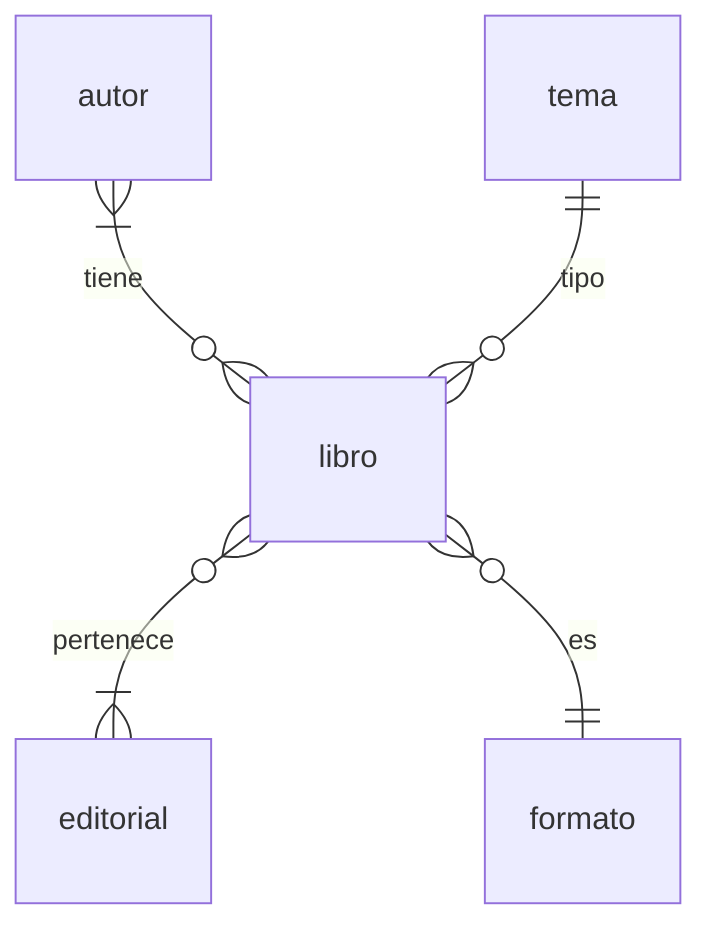

# [Libreria](https://drive.google.com/file/d/1ctEk1Nvl12Lcq7zhmhrspcK4SLFbVuqo/view?usp=sharing)

Realizar un programa que permita administrar una librería/biblioteca. Se deben poder ingresar, modificar, borrar y listar

- **libros**: titulo, cantidad de hojas, año de edicion, editorial, autor
- **editoriales**: nombre, direccion, url
- **autores** (1 libro -> N autores, 1 autor -> M libros),
- **temas** (1 libro -> N temas, 1 tema -> M libros),
- **formatos** ('tapa dura', 'folleto', 'ebook', etc: 1 libro -> 1 formato, 1 formato -> N libros)

El listado de libros mostrará los datos simples, o sea titulo, hojas, año de edicion, editorial, formato. El titulo debe ser un enlace que lleva a una pantalla de detalle donde se veran todos los datos, incluyendo los multivaluados como los autores y los temas. Esta pantalla de detalle puede ser la de edicion o una diferente, pero solo de lectura.

Se deben poder realizar las siguientes consultas:

- libros con determinado titulo
- libros editados por una editorial seleccionada de una lista
- libros que contengan un determinado tema

Acorde a lo que dimos en clase, las tecnologías a usar son las siguientes:

- **Backend**: FastAPI
- **Frontend**: React
- **BD**: PostgreSql
